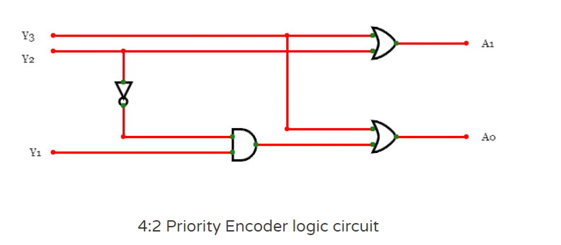
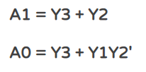
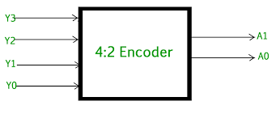
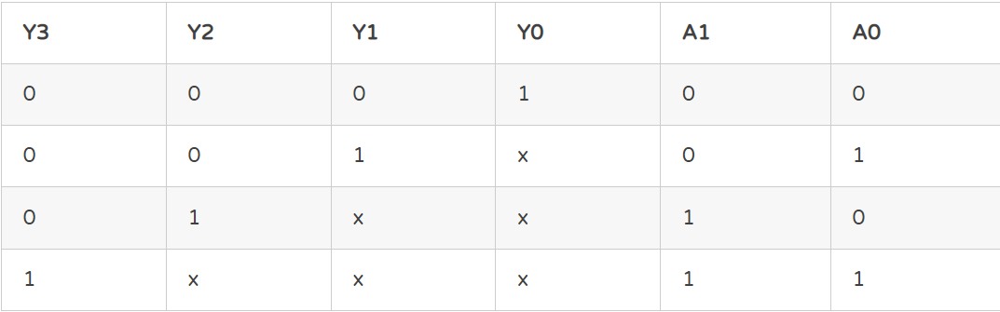
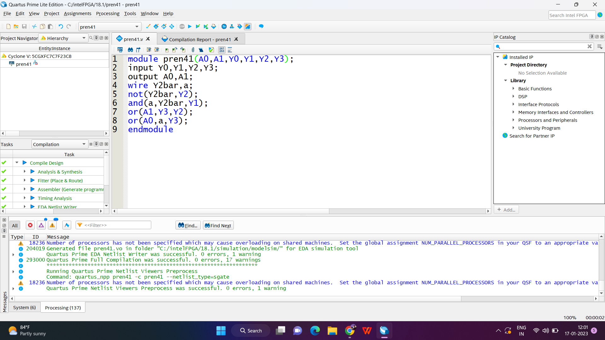
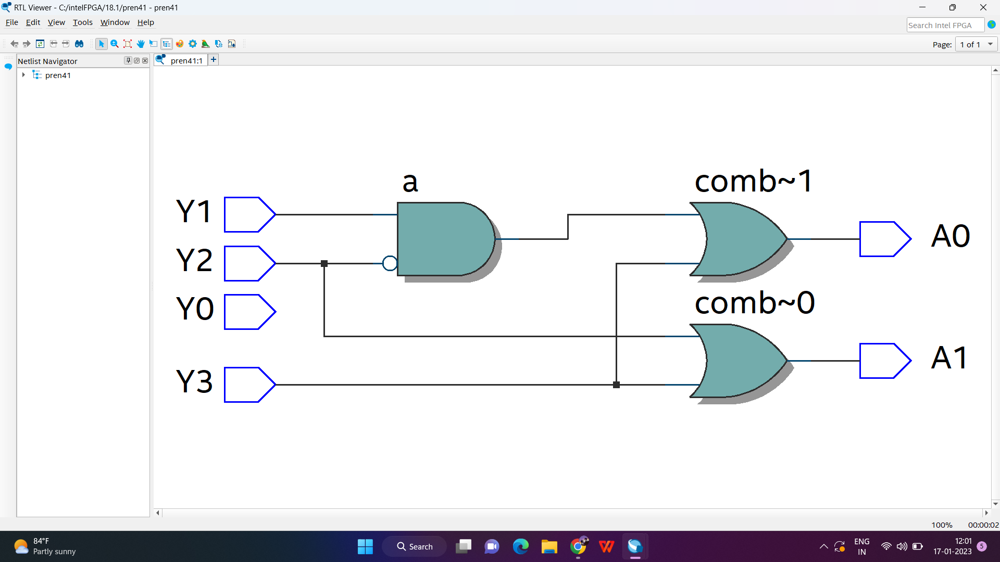
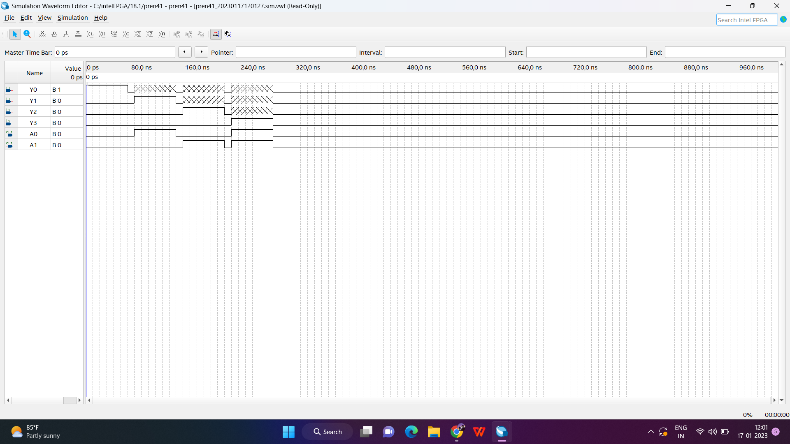

# Skill-Assessment-1
#	Implementation-of-priority-encoder 
###	Aim:
To design and simulate priority encoder using Verilog and verify its truth table in Quartus using Verilog programming.

### Introduction:
Before explaining the priority encoder, you must know what an encoder is.

An encoder is a combinational circuit. It has 2^n input lines and n output lines. It takes up these 2^n input data and encodes them into n-bit data. In other words, it produces the binary code equivalent of the input line, which is active high.
But, a normal encoder has a problem. If there is more than one input line with logic 1 value, it will encode the wrong output. It only works when only one of the inputs is high. It malfunctions in the case of multiple high inputs.

Thus, to solve the above disadvantage, we “prioritize” the level of each input. Hence, if multiple input lines are selected, the output code will correspond to the input with the highest designated priority. This type of encoder is called the Priority Encoder.

### Logic diagram:


### Logical expression:


###	Block diagram:


###	Truth table/ Excitation table:


###	Explanation:
4 to 2 Priority Encoder
This is also referred to as 4- bit priority, which consists of 4 inputs and 2 output lines. Since an encoder contains 2^n input lines and n output lines. The third output is ‘V’, which is considered as a valid but indicator and it is set to 1 when more than one input line is high or active (1).

If the valid bit is equal to ‘0’, then all the inputs are ‘0’. In this case, the other 2 output lines are considered as don’t care conditions denoted by "X"

From the above truth table, we can observe that Y3, Y2, Y1, Y0 are the inputs; A0 and A1 are the outputs and V is the valid bit indicator. Here Y3 input is the highest priority input and Y0 is the lowest priority input.

When the input Y3 is active high (1), which has the highest priority irrespective of all other input lines, then the output of the 4-bit priority encoder is 11.

When the Y3 input is active low and the Y2 is active high that has the next highest priority irrespective of all other input lines, then the output is A1A0=10.

When Y3, Y2 inputs are active low, and the Y1 is active high and has the next highest priority regardless of the remaining input line, then the output will be A1A0 = 01
### Program:
```
module pren41(A0,A1,Y0,Y1,Y2,Y3);
input Y0,Y1,Y2,Y3;
output A0,A1;
wire Y2bar,a;
not(Y2bar,Y2);
and(a,Y2bar,Y1);
or(A1,Y3,Y2);
or(A0,a,Y3);
endmodule
```


###	RTL diagram:


###	Timing diagram:


###	Result:
Thus,design of priority encoder circuit and verify its truth table in Quartus using Verilog programming is executed successfully
